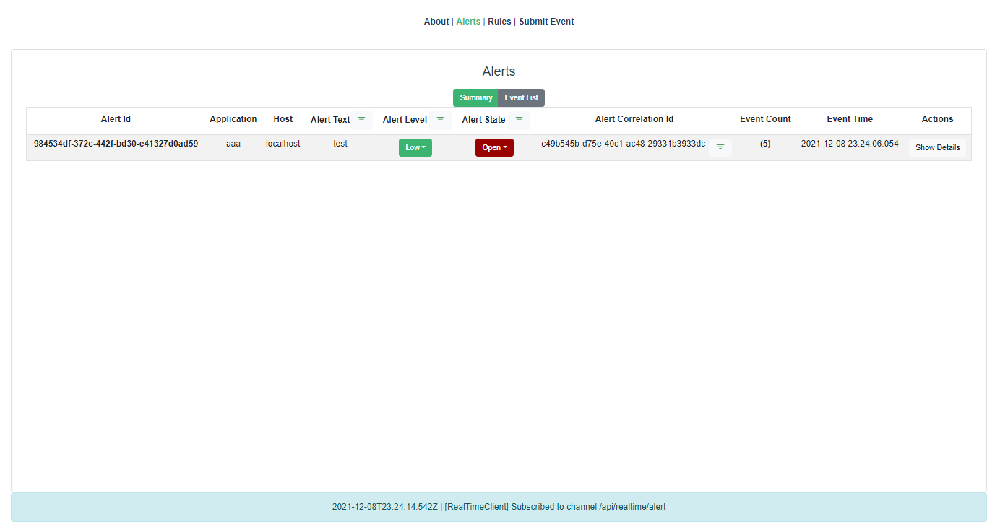

# Asap (Alert Suppression & Processing)

## What is it?

ASAP is system for receving, correlating, suppressing incoming events using http post interface.

There is a restful interface implemented and also a "dashboard" like UI for displaying the alerts and configuring the alert rules.

<b>*Note: T*</b>his started out as a learning excercise using Spring Boot... and is still work in in progress


<br>
## Technology

* Java 11
* Spring Boot Rest
* Spring Boot Websockets
* Spring Boot Security
* Spring JPA (using in memory H2 db)
* SWagger UI enabled
* HTML 5 / Javascript
* VueJS ( for ui )
* Bootstrapvue ( for ui components )
* Socksjs ( for ui websocket updates from backend processing)

## Implementation
<br>
The event to alerting process uses a set of rules that can be edited in the ui and saved to the server.
These rules can be as simple as a text expression or can use regex expressions with named capture groups to extract information from the event.
Where information is captured from the event it can be used in the alert being sent out using a very simple templating system.

http post using json formatted body (could use curl for example) also for ease of use there is also a form in the ui for experimenting with.

Expect timestamp format : yyyy-MM-dd HH:mm:ss.SSS

```
{
    timestamp: "2021-05-12 17:00:00",
    host: "localhost",
    application: "app1",
    message: "hostname: local host has gone down"
}
```
<br>
Example:

<br>
```
hostname: localhost has gone down
```
<br>
regex

<br>
```
.+:.+(?<host>\w+).+
```
<br>
In the output temlate you could define

Send entire regex match

```
{{$0}}
```

Or send custom message
<br>
```
Host {{host}} has had an issue - please investigate
```

Or even just send some text
<br>
```
An unspecified host has reported a problem - see alert for details.
```
<br>
The event processing can also use a set of time schedules to include when to sendan alert or not.

Finally

The rules can have a limited number of simplistic filters applied to prevent alert overloads

| filter | interval | events | Description |
| ------ | -------- | ------ | ----------- |
| suppress | seconds | count | send alert if less than events in time interval |
| threshold | second | count | send alert if events in time  interval exceeds events |
|  |  |  |  |

Originally some additional filters were planned, as yet these have not yet been implemented.

eg
AlertAfter second message in additional regex not seen (or in seconds)

Implementng this would require a timer task... either java noative (though spring has something around schedules too) that would delay for expiry period then perform a have I seen the expected alert in that time frame.

<span class="colour" style="color:var(--vscode-unotes-wysH2)">**<span class="font" style="font-family:var(--vscode-editor-font-family)"><span class="size" style="font-size:22px">Project setup</span></span>**</span>

The project is maven based ( VueJs uses node/npm to build webpack files) and this is handled by the maven project setup.
<br>
```
mvn clean package
```
<br>
The resulting jar can be executed and the web ui reached on localhost:8080

A default login is enabled in the configuration file data.sql ( see location below )
<br>
```
admin
letmein
```

## Configuration
<br>
The defaults are in the backed/src/main/resources/application.properties file.
With the main items of interest being the cors overrides.

As the database is in-memory nothing persists restarts... except saved rules which are written to the file system using the ui.
<br>
## Finally

If this is of interest or useful, great, although I would prefer to keep this repository as-is - I am aiming to use this as a body of work example.... you are welcome to create a clone.
<br>
## References

A few learning resources have been used during this process these are the majority of them

useful info on JPA Repository/Service method naming.
\*  [https://docs.spring.io/spring-data/jpa/docs/1.5.0.RELEASE/reference/html/jpa.repositories.html](https://docs.spring.io/spring-data/jpa/docs/1.5.0.RELEASE/reference/html/jpa.repositories.html)

Spring Boot Websockets (Linkedin Learning)
\* [https://www.linkedin.com/learning/building-real-time-web-apps-with-spring-boot-and-websockets](https://www.linkedin.com/learning/building-real-time-web-apps-with-spring-boot-and-websockets)

Spring Boot Essentials (Linkedin Learning)
\* [https://www.linkedin.com/learning/spring-boot-2-0-essential-training-2](https://www.linkedin.com/learning/spring-boot-2-0-essential-training-2)

Master Java Web Services and RESTful API with Spring Boot
\* [https://www.udemy.com/course/spring-web-services-tutorial/](https://www.udemy.com/course/spring-web-services-tutorial/)

Lastly the following publication

J. Ye, James. Building Applications with Spring 5 and Vue.js 2: Build a modern, full-stack web application using Spring Boot and Vuex . Packt Publishing. Kindle Edition.